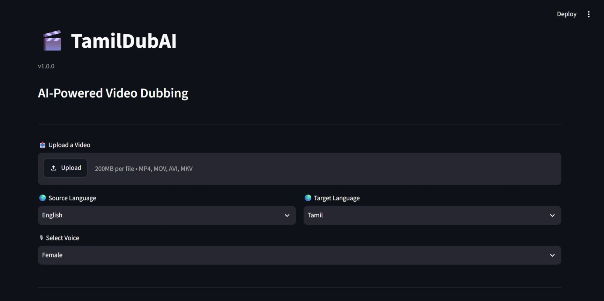
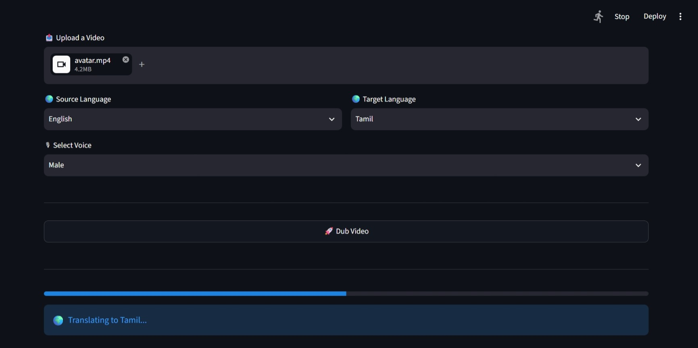
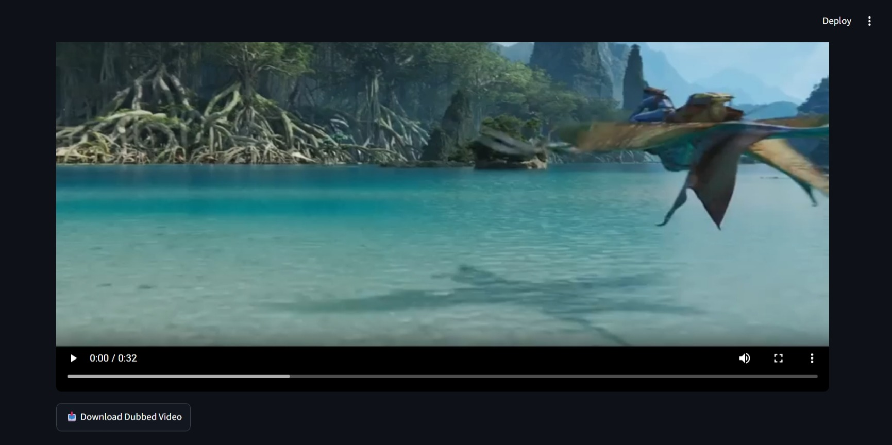

# 🎬 TamilDubAI

<p align="center">
<b>AI-Powered Automatic Video Dubbing Platform</b>
</p>

<p align="center">
Convert videos into Tamil dubbed content using Artificial Intelligence.
</p>

---

## 🌟 Overview

TamilDubAI is an AI-powered video dubbing system that automatically converts spoken content into Tamil.

It combines speech recognition, translation, Tamil text-to-speech generation, and video processing to create a complete dubbed video.

The goal of TamilDubAI is to make multilingual video creation easier using modern AI technologies.

---

# ✨ Features

## 🎙️ Speech Processing

- ✅ Extract audio from video
- ✅ Automatic speech transcription
- ✅ Timestamp-based speech segmentation

## 🌍 Translation

- ✅ Convert speech into Tamil
- ✅ Maintain sentence timing
- ✅ Generate translated Tamil content

## 🔊 AI Voice Generation

- ✅ Tamil Text-to-Speech
- ✅ Male/Female voice selection
- ✅ Automatic voice generation

## 🎬 Video Processing

- ✅ Merge Tamil audio with video
- ✅ Maintain video quality
- ✅ Export final dubbed video

## 🖥️ User Interface

- ✅ Streamlit web application
- ✅ Video upload
- ✅ Live progress tracking
- ✅ Download dubbed output

---

# 🏗️ How TamilDubAI Works

```
Input Video
     |
     ↓
Audio Extraction
     |
     ↓
Speech Recognition
     |
     ↓
Tamil Translation
     |
     ↓
Tamil Text-to-Speech
     |
     ↓
Timeline Audio Creation
     |
     ↓
Video Audio Merge
     |
     ↓
Tamil Dubbed Video
```

---

# 📸 Screenshots






---

# 🚀 Installation

## Clone Repository

```bash
git clone https://github.com/yourusername/TamilDubAI.git
```

Move into project:

```bash
cd TamilDubAI
```

---

## Create Virtual Environment

```bash
python -m venv .venv
```

Activate:

Windows:

```bash
.venv\Scripts\activate
```

---

## Install Dependencies

```bash
pip install -r requirements.txt
```

---

# ▶️ Run Application

Start TamilDubAI:

```bash
streamlit run app.py
```

Open:

```
http://localhost:8501
```

---

# 📂 Project Structure

```
TamilDubAI
│
├── app.py
├── main.py
├── config.py
├── requirements.txt
├── VERSION
│
├── src/
│   ├── speech_to_text.py
│   ├── translator.py
│   ├── text_to_speech.py
│   ├── audio_timeline.py
│   ├── extract_audio.py
│   └── merge.py
│
├── models/
│
├── media/
│   ├── input/
│   ├── output/
│   └── temp/
│
└── screenshots/
```

---

# 🛠️ Technologies Used

| Technology | Purpose |
|---|---|
| Python | Core programming |
| Streamlit | Web interface |
| Whisper | Speech recognition |
| Translation AI | Language conversion |
| Tamil TTS | Voice generation |
| Movie Processing | Video handling |

---

# 🛣️ Roadmap

## ✅ Version 1.0.0 Completed

- [x] Video upload
- [x] Audio extraction
- [x] Speech transcription
- [x] Tamil translation
- [x] Tamil TTS
- [x] Male/Female voice selection
- [x] Timestamp-based dubbing
- [x] Streamlit interface
- [x] Video export


## 🚀 Future Versions

### Professional Audio

- [ ] AI audio separation
- [ ] Background music preservation
- [ ] Sound effect preservation


### Multiple Speakers

- [ ] Speaker detection
- [ ] Different voices per speaker
- [ ] Emotion-based voices


### Lip Sync

- [ ] Better mouth movement matching
- [ ] AI lip synchronization


### More Languages

- [ ] English → Tamil
- [ ] Tamil → English
- [ ] Hindi support
- [ ] Multi-language dubbing


### Deployment

- [ ] Cloud hosting
- [ ] Public URL
- [ ] API access

---

# 📦 Version

Current Version:

```
v1.0.0
```

Status:

```
Stable Release
```

---

# 🤝 Contributing

Contributions are welcome.

Steps:

1. Fork this repository
2. Create a branch
3. Make changes
4. Submit a pull request

---

# 📜 License

MIT License

---

# 👨‍💻 Author

**GOWTHAM M**

Building AI-powered tools for multilingual content creation.

---

<p align="center">
Made with ❤️ using Artificial Intelligence
</p>